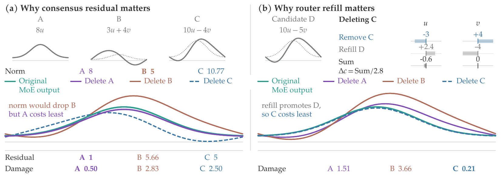

# RAZOR: Pruning Replaceable Experts in LLMs

[](https://arxiv.org/abs/2609.30465)
[](https://huggingface.co/collections/Nickyang/razor-6aa50e30536927640b6572f8)
[](https://huggingface.co/datasets/Nickyang/RazorCal)
[](LICENSE)

RAZOR is a training-free expert pruning method for mixture-of-experts (MoE)
models. An expert's usage or contribution magnitude does not by itself
determine the damage caused by its removal; what matters is whether the
surviving computation can replace its function. RAZOR scores this functional
replaceability with *consensus residuals*: deviations of expert outputs from
the original weighted mixture.

## News

- **2026-09-30:** Released Qwen3.8-Flash-Next **RAZOR** checkpoints at **25%** and
  **50%** expert removal: [96B-A6B](https://huggingface.co/Nickyang/Qwen3.8-Flash-Next-RAZOR-96B-A6B-E384of512)
  and [65B-A6B](https://huggingface.co/Nickyang/Qwen3.8-Flash-Next-RAZOR-65B-A6B-E256of512).
  Names count the main language model; n-gram, MTP and vision weights remain
  included in the downloads. See [Released models](#released-models) for the
  full parameter breakdown and calibration scope.
- **2026-09-30:** Added native Qwen3.8 support, tested with Transformers 5.16.1,
  including conditional-model loading, CPU n-gram placement and MTP-preserving
  export. Standardized the [model collection](https://huggingface.co/collections/Nickyang/razor-6aa50e30536927640b6572f8)
  on **RAZOR** naming; corrected GLM MTP parameter descriptions and synchronized
  the official Gemma tool-call template fixes. See [compatibility and validation scope](docs/models.md).

## Method overview



A constructed single-token example. **(a)** The largest output norm is not the
safest deletion: dropping the expert nearest the mixture costs least. **(b)**
When the router refills the freed slot with its highest-ranked unselected
expert, the promoted output can compensate for a removed contribution and
change which deletion is preferred.

For a token routed to the set $S$ with normalized weights $w_j$, let
$c=\sum_{j\in S} w_j f_j$ be the routed mixture (the consensus) and
$r_j=f_j-c$ the consensus residual of expert $j$. Deleting a selected expert
$i$ makes the router promote its highest-ranked unselected expert $r$, whose
pseudo-weight $w_r$ is its score divided by the original selected score sum.
With $\lambda$ the routed-output scale, the exact local output change is

$$
\delta_i=\lambda\lVert c-\tilde c^{-i}\rVert_2
=\lambda\,\frac{\lVert w_i r_i - w_r r_r\rVert_2}{1-w_i+w_r}.
$$

RAZOR aggregates $\delta_i$ by root mean square over the calibration tokens
routed to each expert, then retains the highest-scoring experts in each layer.
No gradients or recovery training are used.

## Install

Requires Python 3.10+, PyTorch 2.4+ and Transformers 5.8.1 or later in the
5.x series. Select a Transformers build containing your model's native
implementation; GLM-5.3 and Qwen3.8 Flash Next require newer model definitions.
Qwen3.8 uses the `qwen4_exp` architecture declared in the
[official checkpoint config](https://huggingface.co/Qwen/Qwen3.8-Flash-Next/blob/main/config.json),
not `qwen3_next`. Its native implementation is available in the official
[Transformers 5.16.1 release](https://pypi.org/project/transformers/5.16.1/),
which is the version tested here. Kimi's native linear-attention path also
requires its model-specific kernels.

```bash
pip install -e .
git lfs pull
```

Run these commands from a clone. The calibration JSON file uses Git LFS and
is not included in the Python wheel. A custom corpus can be supplied with
`--data`.

## Methods

One saliency collection produces every criterion below from the same
calibration run and the same reconstructed expert outputs.

| `--method` | Criterion | Paper |
|---|---|---|
| `razor` | RCS-Refill under conditional RMS | RAZOR |
| `rcs-refill` | $\lVert w_i r_i - w_r r_r\rVert_2/(1-w_i+w_r)$, deletion with router refill | RCS-Refill, Prop. 1 |
| `rcs-loo` | $w_i\lVert r_i\rVert_2/(1-w_i)$, deletion with fixed routed support | RCS-LOO, Prop. 2 |
| `rcs` | $w_i\lVert r_i\rVert_2$, consensus-residual contribution | RCS |
| `reap` | Routing-weighted expert output norm | baseline |
| `ean` | Expert output norm | baseline |
| `frequency` | Routing count | baseline |

`razor` and `rcs-refill` name the same scoring rule. The three `rcs*` entries
are the scoring components compared in the paper's ablations.

Routed-token scores are aggregated by conditional RMS by default, as in the
paper. `--aggregation mean` and `--aggregation sum` reproduce the aggregation
ablations. See [docs/scoring.md](docs/scoring.md) for score fields and
requirements.

## CLI

```bash
razor models
razor prune --model <model-path> --method razor --ratio 0.5 \
            --out out/pruned-razor-50
```

Replace `<model-path>` with a compatible checkpoint. The checkpoint output
directory must not already exist. Model repository code is disabled by default;
use `--trust-remote-code` only after reviewing and trusting that code.

`--ratio` is the fraction of experts to remove. Alternatively,
`--target-experts` specifies the number to retain per layer. The budget must
be compatible with the model's top-k and routing constraints.

To collect once and reuse the scores:

```bash
razor saliency --model <model-path> --data data/RazorCal.json \
               --out out/sal
razor prune --model <model-path> --saliency out/sal \
            --method reap --ratio 0.5 --out out/pruned-reap-50
razor sweep --model <model-path> --saliency out/sal --out out/grid \
            --methods razor,reap,ean,frequency --ratios 0.25,0.5
```

The scoring-component ablation reuses the same pack:

```bash
razor sweep --model <model-path> --saliency out/sal --out out/ablation \
            --methods rcs,rcs-loo,rcs-refill --ratios 0.25,0.5
```

Collection and checkpoint export requirements depend on the model size,
sequence length, device memory and checkpoint format.
See [examples/quickstart.md](examples/quickstart.md) for data options and checks.

## Model compatibility

The adapters cover routing, expert computation, text wrappers, and native
checkpoint layouts. `razor models` lists accepted configuration types.

| Family | Implemented path |
|---|---|
| Hy3 | FP32 sigmoid router with selection bias and scale; fused/per-expert storage; shared and auxiliary experts |
| DeepSeek-V4 Flash / Pro | sqrt-softplus routing, bounded expert activation, hash routing, FP8/MXFP4 decoding and original-format export |
| GLM-4.7-Flash / GLM-5.2 | Native MoE / DSA model, layer streaming and paired expert/router pruning |
| GLM-5.3 | Text/conditional wrapper, native layer streaming and FP8 weight/scale export |
| Qwen3.5 / Qwen3.6 MoE | Text/conditional wrappers, fused experts and shared-expert preservation |
| Qwen3.8 Flash Next | Native `qwen4_exp`, fused experts, HC/PLE/QSA, CPU n-gram placement and MTP-preserving raw export |
| Gemma 4 MoE | Decoder-level router, separate expert input normalization and per-expert gain |
| Kimi K3 / Kimi Linear | Latent MoE, native expert activation and packed weight/scale preservation |

The paper evaluates GLM-4.7-Flash, Qwen3.6-35B-A3B, DeepSeek-V4-Flash-0731
and Hy3. The other families are implementation-tested with small random native
models only.

`razor` needs the router's rank-(k+1) expert. Every family above exposes it,
except where a decoder-level router hands down only its winners and a replay
of that router does not reproduce the native selection exactly (for example
Gemma 4 in bfloat16). The saved score pack records `refill_supported` per
layer; `rcs-loo` remains available in that case.

Hunyuan support targets Hy3, not V1. Other registered compatibility adapters
remain separate from this family list; their presence is not evidence of a
full-size model evaluation.

`--execution auto` selects layer streaming for these checkpoint families;
`--execution resident` retains whole-model loading. `--export-mode auto`
preserves source safetensors and their quantization metadata instead of saving
a dequantized model. Flash and Pro share architecture handling, but their
storage format is read from each checkpoint rather than inferred from a name.

Forward execution requires the matching native Transformers implementation or
explicitly trusted checkpoint Python files. Storage-only pruning with supplied
scores does not need to construct the model. See [docs/models.md](docs/models.md)
for backend dependencies, hash/MTP policies and validation scope. Tests with
small random native models are implementation checks, not certification of
full-size weights or downstream task quality.

## Released models

Pruned checkpoints produced with `--method razor`, using 32,768-token
calibration rows. Each repository carries the `kept_expert_indices.json`
manifest it was built from; verification requires a Razor version supporting
the model's native architecture. Qwen3.8 reuses historical `MoECal_v2.5`
statistics, not a fresh collection on the current public RazorCal; its model
cards and `calibration_info.json` state the exact calibration scope.

| Backbone | Model | Experts | Removed | Parameters | Active |
|---|---|---|---|---|---|
| GLM-4.7-Flash | [RAZOR-24B-A3B-E48of64](https://huggingface.co/Nickyang/GLM-4.7-Flash-RAZOR-24B-A3B-E48of64) | 48 of 64 | 25% | 24.1B | ~3B |
| GLM-4.7-Flash | [RAZOR-17B-A3B-E32of64](https://huggingface.co/Nickyang/GLM-4.7-Flash-RAZOR-17B-A3B-E32of64) | 32 of 64 | 50% | 17.0B | ~3B |
| Qwen3.6-35B-A3B | [RAZOR-28B-A3B-E192of256](https://huggingface.co/Nickyang/Qwen3.6-35B-A3B-RAZOR-28B-A3B-E192of256) | 192 of 256 | 25% | 27.7B | ~3B |
| Qwen3.6-35B-A3B | [RAZOR-19B-A3B-E128of256](https://huggingface.co/Nickyang/Qwen3.6-35B-A3B-RAZOR-19B-A3B-E128of256) | 128 of 256 | 50% | 19.4B | ~3B |
| DeepSeek-V4-Flash-0731 | [RAZOR-230B-A13B-E192of256](https://huggingface.co/Nickyang/DeepSeek-V4-Flash-0731-RAZOR-230B-A13B-E192of256) | 192 of 256 | 25% | 230B | ~13B |
| DeepSeek-V4-Flash-0731 | [RAZOR-156B-A13B-E128of256](https://huggingface.co/Nickyang/DeepSeek-V4-Flash-0731-RAZOR-156B-A13B-E128of256) | 128 of 256 | 50% | 156B | ~13B |
| Hy3 | [RAZOR-226B-A21B-E144of192](https://huggingface.co/Nickyang/Hy3-RAZOR-226B-A21B-E144of192) | 144 of 192 | 25% | 226B | ~21B |
| Hy3 | [RAZOR-154B-A21B-E96of192](https://huggingface.co/Nickyang/Hy3-RAZOR-154B-A21B-E96of192) | 96 of 192 | 50% | 154B | ~21B |
| Gemma-4-26B-A4B-it | [RAZOR-20B-A4B-E96of128](https://huggingface.co/Nickyang/Gemma-4-26B-A4B-it-RAZOR-20B-A4B-E96of128) | 96 of 128 | 25% | 20.1B | ~4B |
| Gemma-4-26B-A4B-it | [RAZOR-14B-A4B-E64of128](https://huggingface.co/Nickyang/Gemma-4-26B-A4B-it-RAZOR-14B-A4B-E64of128) | 64 of 128 | 50% | 14.4B | ~4B |
| Qwen3.8-Flash-Next | [RAZOR-96B-A6B-E384of512](https://huggingface.co/Nickyang/Qwen3.8-Flash-Next-RAZOR-96B-A6B-E384of512) | 384 of 512 | 25% | 95.529B main model | ~6B |
| Qwen3.8-Flash-Next | [RAZOR-65B-A6B-E256of512](https://huggingface.co/Nickyang/Qwen3.8-Flash-Next-RAZOR-65B-A6B-E256of512) | 256 of 512 | 50% | 65.314B main model | ~6B |

For the first five backbones, parameter counts include stored MTP modules,
whose expert pools are pruned to the same budget. Qwen3.8 names and the two
main-model values instead exclude n-gram tables, MTP and vision, separating
these components as the official model card does:

| Qwen3.8 budget | Main language model | N-gram tables (unchanged) | Stored MTP | Vision (unchanged) | Full stored total |
|---|---|---|---|---|---|
| 25% removed | 95.529B | 51.200B | 1.978B | 0.449B | 149.156B |
| 50% removed | 65.314B | 51.200B | 1.348B | 0.449B | 118.312B |

N-gram weights remain in both downloads. HF's automatic parameter badge counts
the complete checkpoint, not just the language-model naming scope. Exact
component counts are in the model cards and `release_info.json`.
Active parameters follow each official base model's convention; top-$k$ and
shared experts are preserved, but this is not a new FLOP or throughput measurement.
DeepSeek-V4-Flash stores routed experts in MXFP4; its counts account for 4-bit
packing. Vision weights are left intact; text calibration is not a multimodal
quality evaluation. Each model retains its base license: MIT for GLM-4.7-Flash
and DeepSeek-V4-Flash; Apache-2.0 for Qwen3.6, Hy3 and Gemma 4;
Qwen Community License 1.0 for Qwen3.8-Flash-Next.
Selection depends on the calibration draw, so an independent run reproduces the
procedure rather than these exact expert sets.

## RazorCal

The default corpus is `data/RazorCal.json`: 2,048 samples in seven domains,
with 512 Coding samples and 256 each in Math, Science (STEM), Chinese-STEM,
Instruction Following, Tool Calling and World Knowledge.
Records contain calibration inputs and source attribution. The same corpus is
published on the Hub as
[Nickyang/RazorCal](https://huggingface.co/datasets/Nickyang/RazorCal):

```python
from huggingface_hub import hf_hub_download
import json

path = hf_hub_download("Nickyang/RazorCal", "RazorCal.json", repo_type="dataset")
corpus = json.load(open(path, encoding="utf-8"))
```

- [Data README](data/README.md): format and recorded sources.
- [Datasheet](data/DATASHEET.md): intended use and limitations.
- [Provenance status](data/FIDELITY_AUDIT.md): scope of available evidence.

## Licenses and attribution

Project code uses [Apache-2.0](LICENSE). The vendored REAP reference retains
its [upstream license](third_party/reap/LICENSE) and attribution in [NOTICE](NOTICE).
RazorCal records are subject to their applicable upstream terms; this repository
does not establish a single replacement license for all records.
See [data/LICENSE-DATA](data/LICENSE-DATA) before use or redistribution.
Base-model weights are not included and have separate terms.

## Citation

```bibtex
@misc{song2026razorpruningreplaceableexperts,
      title={RAZOR: Pruning Replaceable Experts in LLMs},
      author={Mingyang Song and Mao Zheng},
      year={2026},
      eprint={2609.30465},
      archivePrefix={arXiv},
      primaryClass={cs.LG},
      url={https://arxiv.org/abs/2609.30465},
}
```
